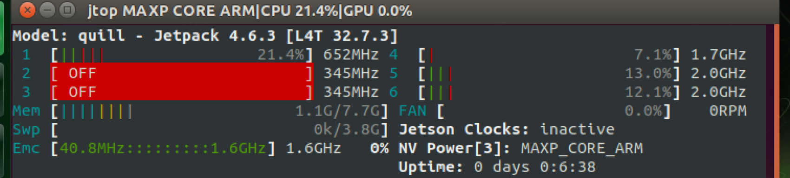
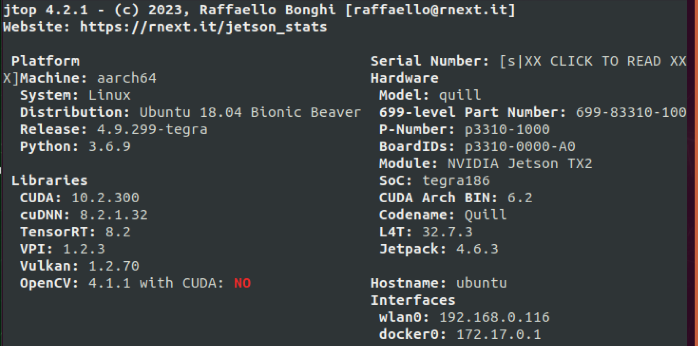
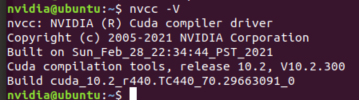
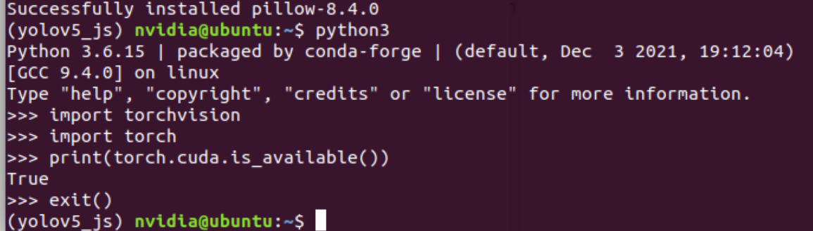
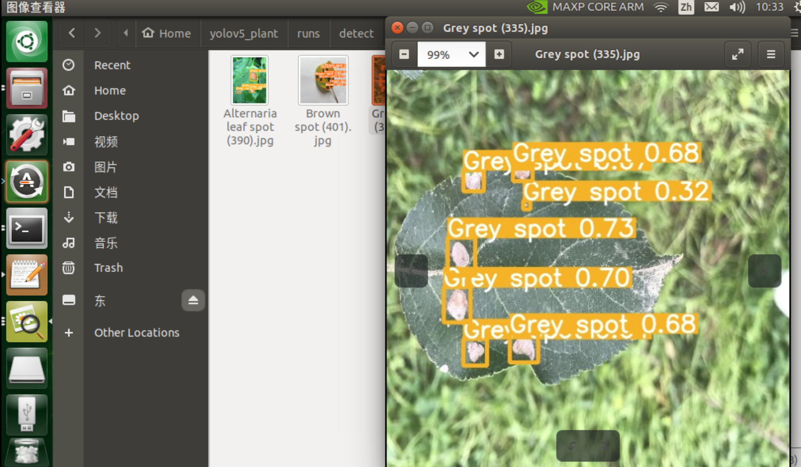
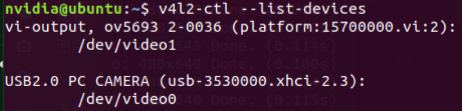
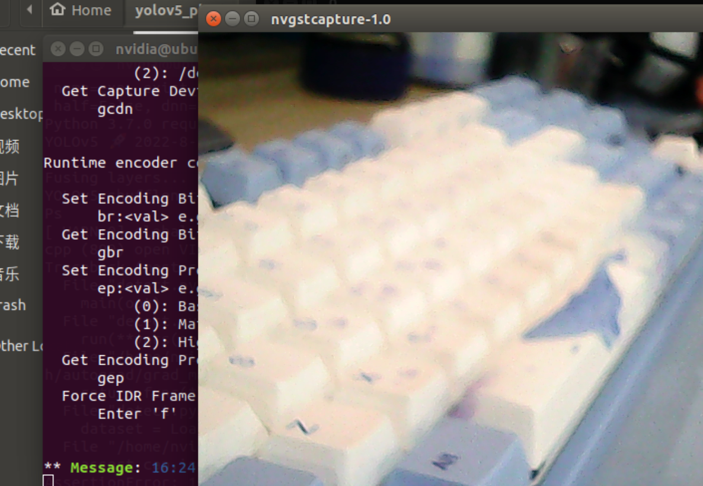
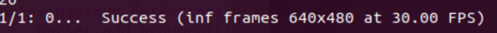
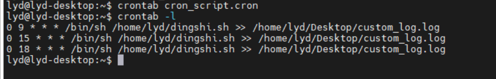
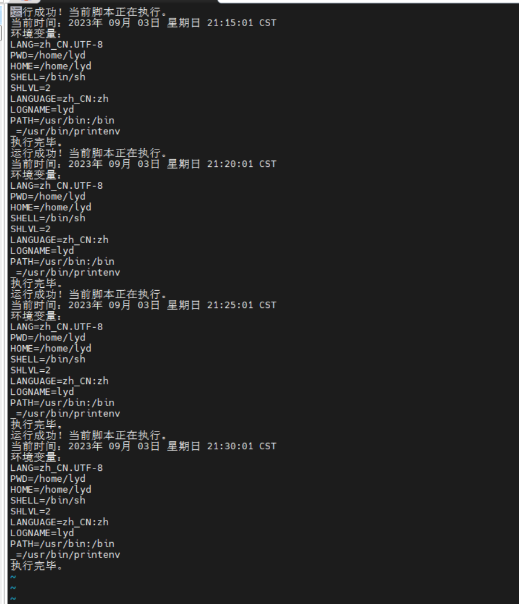

# jetson_yolov5

jetson_tx2 jetson_nano deploy yolov5 model

## jetson tx2完成yolov5病虫害检测模型的部署

1.下面在尝试进行jetson tx2上面的yolov5病虫害检测模型部署。

2.昨天和今天完成了jetson tx2的整个刷机流程，整体刷机流程将在后续补上。

3.下面开始jetson tx2的yolov5模型部署操作。我将把一些操作与遇到的问题记录下来。

（1）首先安装jtop查看xt2的基本信息。

```
sudo apt-get install python3-pip
sudo -H pip3 install -U jetson-stats
##然后重启一下
jtop
```

关注基本信息如下：





（2）安装虚拟环境管理工具Archiconda

下载地址：https://github.com/Archiconda/build-tools/releases

```
./Archiconda3-0.2.3-Linux-aarch64.sh
sudo chmod -R 777 /home
./Archiconda3-0.2.3-Linux-aarch64.sh
vim ~/.bashrc
#在最后一行输入
export OPENBLAS_CORETYPE=ARMV8
export PATH=~/home/anaconda3/bin:$PATH
#保存退出
source ~/.bashrc
```

（3）配置CUDA

```
vi .bashrc
#拉到最后，在最后添加这些
export PATH=/usr/local/cuda-10.2/bin${PATH:+:${PATH}}
export LD_LIBRARY_PATH=/usr/local/cuda-10.2/lib64${LD_LIBRARY_PATH:+:${LD_LIBRARY_PATH}}
export CUDA_ROOT=/usr/local/cuda

source ~/.bashrc
nvcc -V
```



（4）创建虚拟环境

```
conda create -n yolov5_js python=3.6
```

(5)安装pip3并配置所需要的库

```
sudo apt-get update
sudo apt-get install python3-pip python3-dev -y
sudo apt-get install build-essential make cmake cmake-curses-gui -y
sudo apt-get install git g++ pkg-config curl -y
sudo apt-get install libatlas-base-dev gfortran libcanberra-gtk-module libcanberra-gtk3-module -y
sudo apt-get install libhdf5-serial-dev hdf5-tools -y
sudo apt-get install nano locate screen -y
```

(6)安装所需要的依赖环境

```
sudo apt-get install libfreetype6-dev -y
sudo apt-get install protobuf-compiler libprotobuf-dev openssl -y
sudo apt-get install libssl-dev libcurl4-openssl-dev -y
sudo apt-get install cython3 -y
```

（7）安装opencv的系统级依赖,一些编解码的库

```
sudo apt-get install build-essential -y
sudo apt-get install cmake git libgtk2.0-dev pkg-config libavcodec-dev libavformat-dev libswscale-dev -y
sudo apt-get install python-dev python-numpy libtbb2 libtbb-dev libjpeg-dev libpng-dev libtiff5-dev libdc1394-22-dev -y
sudo apt-get install libavcodec-dev libavformat-dev libswscale-dev libv4l-dev liblapacke-dev -y
sudo apt-get install libxvidcore-dev libx264-dev -y
sudo apt-get install libatlas-base-dev gfortran -y
sudo apt-get install ffmpeg -y
```

（8）更新CMake

```
wget http://www.cmake.org/files/v3.13/cmake-3.13.0.tar.gz
tar xpvf cmake-3.13.0.tar.gz cmake-3.13.0/  #解压
cd cmake-3.13.0/
./bootstrap --system-curl	# 漫长的等待,做一套眼保健操...
make -j4 #编译  同样是漫长的等待...
echo 'export PATH=~/cmake-3.13.0/bin/:$PATH' >> ~/.bashrc
source ~/.bashrc #更新.bashrc
```

(9)pytorch安装

jetson 上的linux是类似于手机的ARM架构，这也就导致很多包与普通的linux上的不通用。因此pytorch包应该在NVIDIA官网上去下载对应的，此处由于jetpack与python的版本以及之前部署的jetson nano上的版本相对应，选择torch=1.8,torchvision=0.9的版本。也可选取其他版本，但注意板子的系统版本与python版本。

```
pip3 install torch-1.8.0-cp36-cp36m-linux_aarch64.whl
#不要用sudo指令，这个指令会将torch安装到外部环境，torchvision类似
```

安装完成之后可导入cv2测试

```
python3
import torch
print(torch.__version__)
```

(10)torchvision安装

提前安装好环境依赖

```
sudo apt-get install libopenmpi2
sudo apt-get install libopenblas-dev
sudo apt-get install libjpeg-dev zlib1g-dev
```

进入torchvision文件夹

```
export BUILD_VERSION=0.9.0
python setup.py install
#安装完成之后进行测试
python
import torchvision
print(torchvision.__version__)
print(torch.cuda.is_available())
```




可能会自动安装 pillow 9.2.0版本，这时候pillow 的版本过高
在python3 环境中导入 torchvision 时报错如下：SyntaxError: future feature annotations is not defined

```
pip3 install pillow==8.4.0
```

（11)搭建YOLOv5环境

```
pip install -r requirements.txt 
#缺什么补什么
```

（12）运行检测代码

```
python3 detect.py --weights yolo-16.pt
```



(13)模型训练

```
python3 train.py
```

## jetson 完成USB摄像头的调用

1.安装v4l2-utils协助工具

```
sudo apt install v4l-utils 
```

2.查看主板USB摄像头设备连接情况

```
v4l2-ctl --list-devices
```



3.检查摄像头是否运行

```
nvgstcapture-1.0 --camsrc=0 --cap-dev-node=1
```

默认就能看到摄像头的画面

4.对detect.py代码进行修改，修改--source参数，改为摄像头的设备号：例如此时即为video0。

5.运行yolo检测模型即可进行实时检测。




## jetson 设置USB摄像头的分辨率

一.因为USB摄像头支持的分辨率与帧率有很多种，过高的分辨率会导致模型运行吃力，降低模型的运算速度，因此设置合适的分辨率有助于提高模型的检测精度与检测速度

二.下面为具体的步骤：

1.

```
sudo v4l2-ctl --list-devices//通过v4l2查看摄像头设备
```

此时我使用的tx2的摄像头为video0

2.查看摄像头的具体参数

```
sudo v4l2-ctl --device=/dev/video1 --all//查看/dev/video1 摄像头所有参数
sudo v4l2-ctl -d /dev/video0 --list-formats//查看当前摄像头支持的视频压缩格式
sudo v4l2-ctl -d /dev/video0 --list-formats-ext//查看当前摄像头支持的分辨率和帧速率
```

3.对摄像头的参数进行设置

```
sudo v4l2-ctl -d /dev/video0 --set-parm=30//设置帧率
sudo v4l2-ctl --list-framesizes=MJPG -d /dev/video0//查看摄像头所支持的分辨率
sudo v4l2-ctl --set-fmt-video=width=640,height=480,pixelformat=YUYV
```

4.运行模型观察是否为我们设置的参数



## jetson tx2端使用tensorrt对模型进行加速

建立软链接
TensorRT的系统安装路径为：/usr/lib/python3.6/dist-packages/tensorrt/（这个是大家都一样不变的）
执行以下命令，建立虚拟环境（自己的虚拟环境）对应的软链接（注意自己的archiconda的安装目录，这是本人目录仅供参考/home/alen123/archiconda3/envs/yolov5_js/lib/python3.6/site-packages）

```python
sudo ln -s /usr/lib/python3.6/dist-packages/tensorrt* /home/archiconda3/envs/yolov5_js/lib/python3.6/site-packages
```

### 查看版本

```python
>>> python
>>> import tensorrt
>>> tensorrt.__version__
```

## 运行export.py和detect.py

完成上步工作之后，tensorRT已经作为一个包可以直接调用了，然后直接在终端执行以下代码：

```python
python export.py --weights yolo-16.pt --include engine -- device 0 
```

然后就会生成一个xx.engine文件，再执行detect.py，可以在文件里改，如果懒得改也可以直接命令行改模型：

```python
python detect.py --weights yolo-16.engine
```

## 定时执行程序命令

1.首先检查是否安装cron定时指令

2.创建一个名为cron_script.cron的文件

```Linux
nano cron_script.cron
vi cron_script.cron
gedit cron_script.cron
```

3.向cron_script.cron文件中写入定时执行的.sh文件的命令，并将日志进行输出

```
0 9 * * * /bin/sh /home/lyd/dingshi.sh >> /home/lyd/Desktop/custom_log.log
0 15 * * * /bin/sh /home/lyd/dingshi.sh >> /home/lyd/Desktop/custom_log.log
0 18 * * * /bin/sh /home/lyd/dingshi.sh >> /home/lyd/Desktop/custom_log.log
```

4.使用以下命令将该计划任务添加到Cron：

```
crontab cron_script.cron
```

5.使用以下指令检查cron定时脚本

```
crontab -l
```



6.编写定时执行文件dingshi.sh

```
#!/bin/bash

# Activate the conda environment using absolute path
source /home/lyd/archiconda3/bin/activate yolov5_js

# Navigate to the directory
cd yolov5_plant

# Run the Python script
timeout 300s python3 detect.py --weights yolo-16.engine --source 0
psshutdown /h /t 0

```

7.编写测试的.sh文件

```
#!/bin/bash

# 打印运行成功的指令
echo "运行成功！当前脚本正在执行。"

# 打印当前时间
echo "当前时间：$(date)"

# 打印环境变量
echo "环境变量："
printenv

# 执行其他命令或脚本
# command_to_execute

# 执行完毕，打印完毕信息
echo "执行完毕。"
psshutdown /h /t 0
```

8.编写测试cron

```
*/5 * * * * /bin/sh /home/lyd/ceshi.sh >> /home/lyd/Desktop/test_log.log
```

9.执行结果



可看到是在每五分钟之后执行一次的

10.编写在8:55唤醒的.sh文件

```
#!/bin/bash

# Activate the conda environment using absolute path
source /home/lyd/archiconda3/bin/activate yolov5_js

# Navigate to the directory
cd yolov5_plant

# Run the Python script
timeout 300s python3 detect.py --weights yolo-16.engine --source 0
current_hour=$(date+%H)
current_minute=$(date+%M)
current_time=$((current_hour*60+current_minute))
target_time=$((8*60+55)) #8:55 AM the next day in minutes
time_until_target=$((target_time-current_time-1))

rtcwake -m no -s "$time_until_target"

```

11.测试

```
# 打印运行成功的指令
echo "运行成功！当前脚本正在执行。"

# 打印当前时间
echo "当前时间：$(date)"

# 打印环境变量
echo "环境变量："
printenv

# 获取当前时间的小时和分钟
current_hour=$(date +%H)
current_minute=$(date +%M)

# 计算当前时间的总分钟数
current_time=$((current_hour * 60 + current_minute))

# 计算五分钟后的时间
target_time=$((current_time + 5))

# 设置系统在五分钟后唤醒
rtcwake -m no -s "$((target_time * 60))"  # Wake up without power-off

# 脚本的其余部分，例如您的任务命令
echo "五分钟后的时间：$(date)"
# Your task commands here

# 等待任务完成后
echo "执行完毕。"
```

